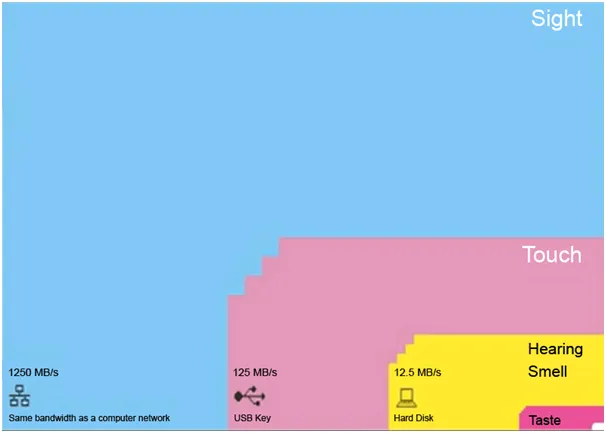
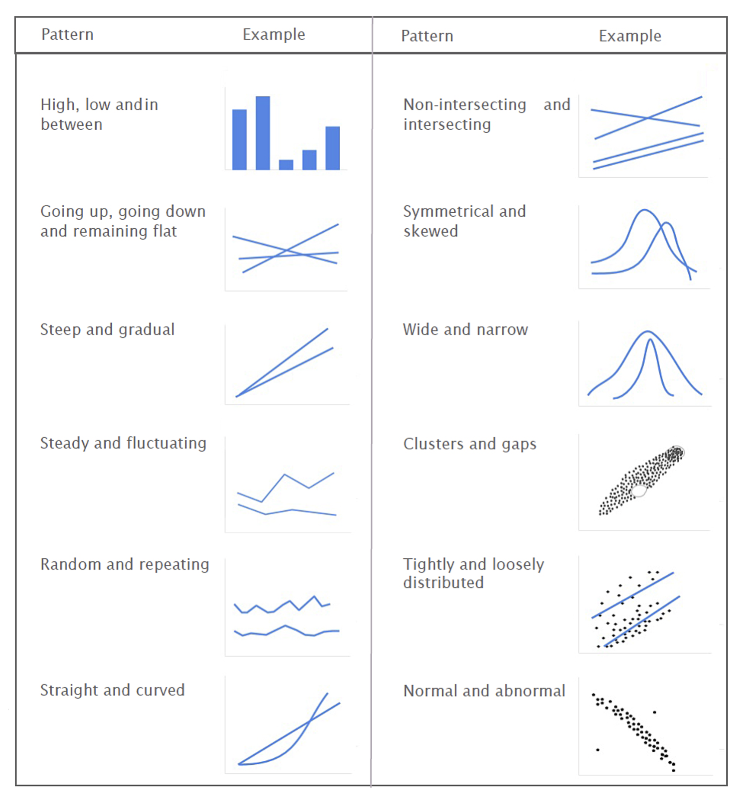
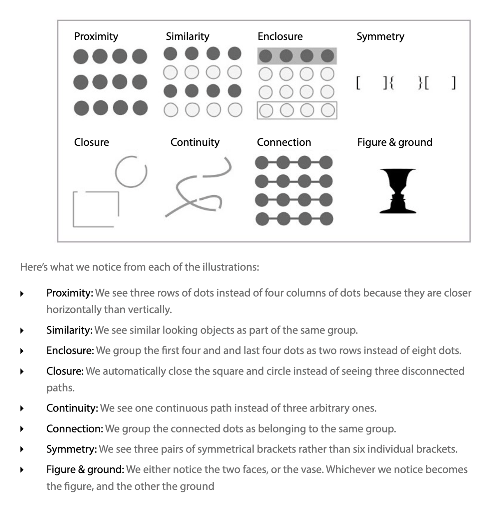
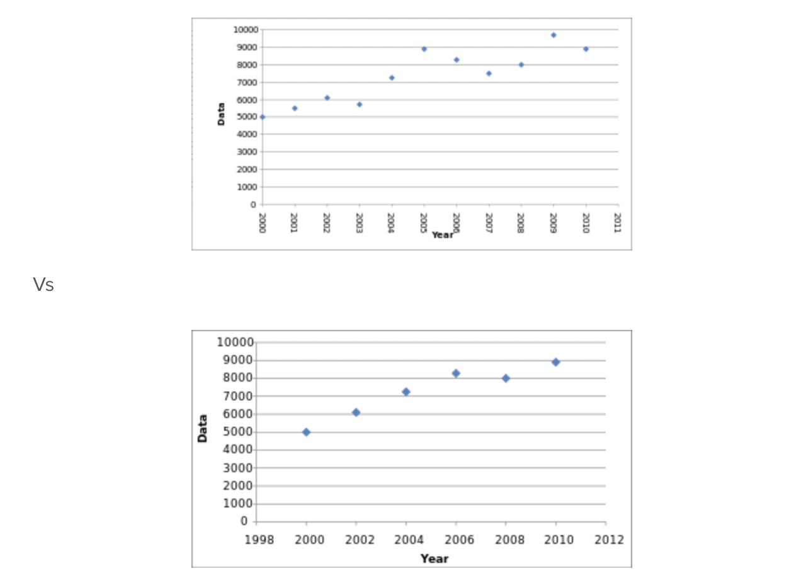

# Assignment Questions:
1. After watching the TED Talk on the beauty of data visualization, which 2 key points do you think are most important in data visualization, and why? 
2. After reading the Principles of Data Visualization and Chapter 1 of Effective Data Visualization, what were your top two takeaways?
3. In Chapter 1, Evergreen talks about how visualization can be harmful, can you share one more visual example (outside of the textbook and class materials) that comes to mind that you have seen recently? Please include links.

## TED TALK Mod1
### Video Summary
[Video Link](https://www.youtube.com/watch?time_continue=13&v=5Zg-C8AAIGg&embeds_referring_euri=https%3A%2F%2Fsofia.instructure.com%2F&source_ve_path=Mjg2NjY&feature=emb_logo&themeRefresh=1)

### Key Points from Video:
- Data is the new soil
- Data is a kind of ubiquitous resource that we can shape to provide new innovations and new insights
- Tor Norretranders: Bandwidth of sensors in computer terms:
 
- The main venue of data reception for human beings is through the visual sight data and our eyes are sensitive to patterns in variations of colors and shapes.
- Combine language of the eye (shapes and patterns and colors) with the language of the mind (numbers, words and concepts) = two languages simultanouesly each enhancing the other 
- The military budget example: absolute figures don't give the whole pictures --> we need relative figures that are connected to the other data 
- Data visualization is a form of knowledge compression, a way of squeezing an enormous amount of information and undestanding into a small space (snake oil graph example)
- information visualization can also apply to ideas and concepts
- (political spectrum example)
- seeing political perspective vs being told them: first one lets you hold conflicting view points joyously --> data can change perspective 
- information design = solving information problems 
- visualizing the information 

### The two most important points in data visualization:
- Direct quote: "Data is a kind of ubiquitous resource that we can shape to provide new innovations and new insights" 
- Data visualization is a form of knowledge compression, a way of squeezing an enormous amount of information and undestanding into a small space
- The main venue of data reception for human beings is through the visual sight data and our eyes are sensitive to patterns in variations of colors and shapes.
Combine language of the eye (shapes and patterns and colors) with the language of the mind (numbers, words and concepts) = two languages simultanouesly each enhancing the other.
----
### Principles of data visualization summary:
1. Why we visualize data? 
- **A visual can communicate more information than a table in a much smaller space.** 
- **Edward Tufte, a data visualization expert, says ‘Graphical excellence is that which gives to the viewer
the greatest number of ideas in the shortest time with the least ink in the smallest space.’ This trait of
visualizations is what makes them vital to business.**
2. Two goals in data visualization:
- Explanatory: Explain data to solve specific problems
- Exploratory: Explore large data sets for better understanding 
3. The role of memory in vision:
- **Preattentive attributes used by our working memory:** These attributes are what
immediately catch our eye when we look at a visualization:
    - Form:
        - Orientation
        - Line Length/Width
        - Size
        - Shape
        - Curvature
        - Added Marks
        - Enclosure
    - Color:
        - Intensity
        - Hue
    - Spatial Position:
        - 2D Position

Of this list, only Position, and Length
can used to perceive quantitative data with precision. The other attributes are useful for perceiving other
types of data such as categorical, or relational data.
- **Analytical Patterns**: If preattentive attributes are the alphabets of visual language, analytical patterns are the words we form 
using them. 

- **Gestalt principles describe how our mind organizes individual elements into groups**:

---
### Effective Data Visualization Chapter 1 Summary:
1. Start with asking what the point is in the data visualization task at hand. Since we visualize to :
    - Communicate a point
    - Add legitimacy and credibility
- When Visualization is harmful:
    - One example was changing aspects of the graph that lead to deception
- Tell a story with data is not very effective for decision making purposes for most of the time and can only be used for certain cases such as reviewing an academic paper or etc.
---
### Another example indicating how data visualization can be harmful:
- Data Omitting:
By omitting some data you can intentionally create deceptive trends and data visualization. By choosing data from every other year instead of every year, in the example below the data seems to increase constantly. Whereas the actual behaviour is more volatile. Companies can abuse this misleading data visualization into claiming their earning is constatnly increasing and predictable. 

[Content source](https://cogentlegal.com/2014/04/graphics-go-beyond-advocacy-to-misleading/) 

